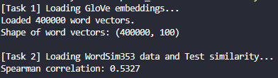
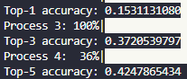

# Word Embedding

## Evironment
- python: 3.13.2
- pandas ~= 2.2.3
- nltk ~= 3.9.1
- scikit-learn ~= 1.6.1
- matplotlib ~= 3.10.1
- seaborn ~= 0.13.2
> 直接沿用上次的環境，所以大部分沒有用到

## Detail
- 我將整個處理的部分接包成一個 class 為 `WordEmbedding`
- 以下是測試三個項目的function
    - `run_task1_load_embeddings`
    - `run_task2_wordsim_similarity`
    - `run_task3_bats_analogy`
- 在類比預測的部分，因為資料量不小，加上其中用 cosine 計算相似度，會導致整體計算時間非常長，所以預設是利用 multiprocess 的方式來計算，並且透過 `tqdm` 來顯示每個 process 的進度。若想不開，要使用無 multiprocess 的版本，請在 `run_task3_bats_analogy` 將 `predict_analogy_top_k_parallel` 改為 `predict_analogy_top_n`。(強烈建議不要，因為我真的沒有優化那個 function)
- 在類比預測中，有加入 **Top-k** 機制，有 Top-1、Top-3、Top-5。

## Result

### Task 1 and Task 2

### Task 3

